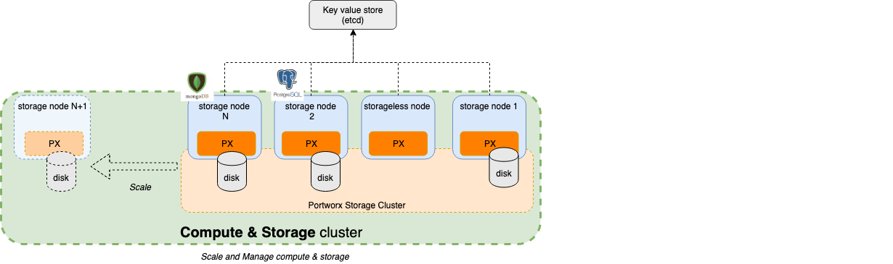

As more and more applications convert to cloud native with Kubernetes as a normalizing layer the ability to have portability between public clouds also becomes easier. Theoretically, the app can now move easily between AWS/Azure/GCP. However, a couple of issues are always in the back of developer’s minds: 
 
* Do I connect to cloud services like ML/AI, DevOps tool chains, DBs, Storage, etc? This might lock me in.
* Should I roll my own database or use a cloud services like CosmosDB, Azure Postgres DB, etc.?
 
I covered the complexity of the second question in a previous article. [Application state what is easier?](https://www.cloudjourney.io/articles/devops/application-state-whats-easier-bs/)

Today I will cover what it cost differential between rolling your own on K8S vs using a service like RDS from AWS. 

In order to show case the differences, I will use the [Acme Fitness Shop App](https://github.com/vmwarecloudadvocacy/acme_fitness_demo) deployed in two Kubernetes configurations:

* Deploy the e-commerce application with Portworx on the Kubernetes cluster. Portworx will support volumes in AWS EC2 which will give persistence storage, and other capabilities like DR, security, etc.
* Deploy the e-commerce application with RDS. This is generally the logical choice since its easy to bring up and manage on AWS.

I'll also use **Postgres** on both with similar configurations to properly compare them. 

In [Acme Fitness Shop App](https://github.com/vmwarecloudadvocacy/acme_fitness_demo) there are multiple services connecting to different databases. For this article, I only varied the Order Service configuration, which connects to Postgres. Hence, one version uses Portwrox + postgres operator, and the other AWS RDS+Postgres.

So, how do we compare the costs? We used Cloudhealth for comparing the two configurations.

## Some component basics and configuration:

A quick review of the main components used in this blog:

1.  **Cloudhealth:** Used to calculate the costs of each configguration. Its a SaaS service from VMware that provides an ability to easily manage cost, ensure security compliance, improve governance and automate actions across multi-cloud environments. Known for offering the highest levels of data integrity throughout an organization’s entire cloud journey, CloudHealth is the platform of choice for leading enterprises and service providers.

2.  **Portworx** - The Portworx Enterprise Storage Platform is your end-to-end storage and data management solution for all your Kubernetes projects. Portworx provides a slew of [features](https://portworx.com/products/features/) that include high availability, disaster recovery, backup and restore, security, automated capacity management, multi-cluster management and migration of application and data that those applications are using. The benefit of Portworx on AWS is the abstraction of underlying EBS such that every volume an application uses is optimized for cost and abstracted to provide the best experience without sacrificing performance or flexibility. In fact, in most cases, Kubernetes used will have an [improved operations](https://portworx.com/ebs-stuck-attaching-state-docker-containers/) and [better economies of scale](https://portworx.com/architects-corner-aurea-beyond-limits-amazon-ebs-run-200-kubernetes-stateful-pods-per-host/). 



In this setup, each Portworx node in the EKS cluster was configured with a single EBS volumes using [automated volume templates](https://docs.portworx.com/cloud-references/auto-disk-provisioning/aws/#1-using-a-template-specification). Portworx then pools these together to allow applications on the K8S cluster to create virtual thin-provisioned, highly available Persistent Volumes (PVs) which support the Postgres deployment.

> Note that portworx backing drives were configured with the same capacity and performance (gp2) as the RDS instance such that the two configurations were using the same type of EBS from a cost perspective to support Postgres.

3. **AWS EKS** - Elastic Kubernetes Service - Two exactly similar clusters were configured with the following config using EKS CTL

```
eksctl create cluster --name acme-portworx --region us-east-1 --node-type t3.large --nodes 3
```

4. **postgres-operator** - There are several Postgres Operators available. I used the [zalando/postgres-operator](https://github.com/zalando/postgres-operator). This enabled deployment of postgres on to the Portworx volumes.

5. **AWS RDS** - was configured for Postgres with a MultiAz configuration with 200G capacity. (same as Portworx)

6. **[Acme Fitness Shop App](https://github.com/vmwarecloudadvocacy/acme_fitness_demo)** - PUT IN TWO IMAGES OF THE TWO CONFIGURATIONS 

As part of the configuration I also did not configure backups nor run any loads on the configuration in order to keep the comparison simple. 

## What's the cost differential?

Before we walk through the detailed configuration and setup, its useful to see the output
Cloudhealth provides in analyzing either configuration.

Both configurations were run for 5 days. In order to properly collect data on either configuration, two filters (perspectives in cloud health) were set up to properly collect data on the relevant components in each configuration. (I'll review the configuration details in a later section.)

Since the logical configuration most people would use is RDS, lets start with the RDS configuration.

### RDS


Because EKS clusters are a combination of multiple components, the EKS cluster in this configuration is made up of EC2 isntances and  EBS storage (volumes).  The cost of running an EKS cluster is $6.18/day.

The application requires a load balancer, and the data transfer into and out of the application is only $0.61/day.

RDS, on the other hand uses EC2, EBS, data transfer, and replicas. These are all noted with RDS label per line in the table. RDS runs $15.01/day.

The total cost of the configuration runs $21.81/day.

The cost of running  RDS  is roughly ~2.5x the cost of running an EKS cluster.

### Portworx


Because EKS clusters are a combination of multiple components, the EKS cluster in this configuration is made up of EC2 isntances and  EBS storage (volumes).  

Portworx adds volumes to help support the installation of a database, hence the cost of EBS storage is $3.58/day. This consists of 9 volumes, 6 of which are configured by Portworx, and 3 are baseline EKS cluster volumes.

Let's review the breakdown of the volume costs.


If we just take the baseline EC2 (EKS Cluster) volumes ($.06/day), then the total cost of the EKS cluster (EC2 + EBS) is $6.18/day - SAME as the RDS cluster.

Portworx adds $3.40/day of volume costs.

Oddly this additional cost is still minimal addition to the total/day cost for the Portworx configuration. 

At $10.81/day the Portworx configuration is 50% cheaper than the RDS configuration. 


## Detailed configurations

